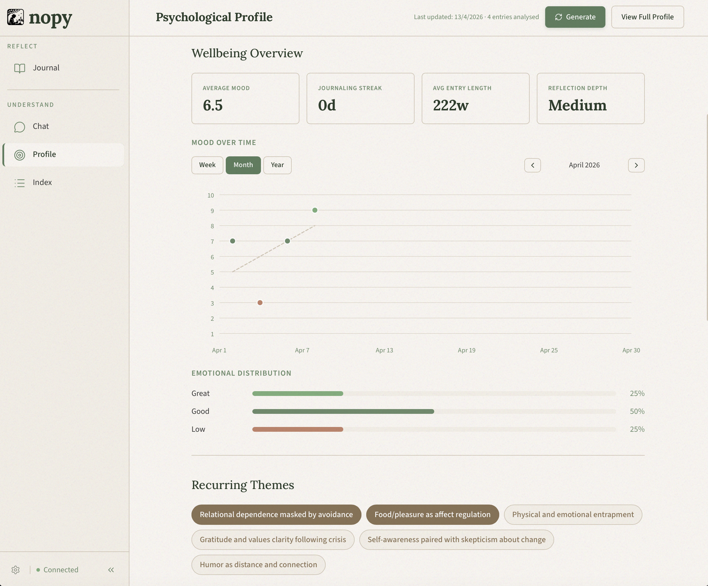
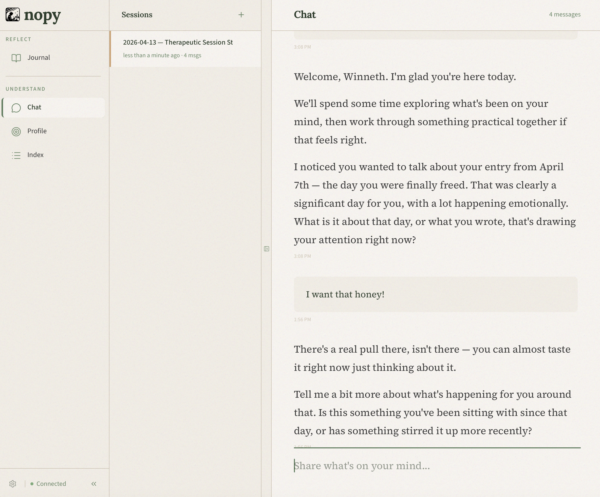

<h1 align="center">nopy</h1>

<p align="center">
  <strong>A quiet, local-first journal that thinks with you.</strong><br/>
  <sub>Your words live on your machine as plain Markdown. The AI features run through your own Anthropic key — nothing in between, no accounts, no servers of ours.</sub>
</p>

<p align="center">
  <a href="#"></a>
  <a href="LICENSE"></a>
  <a href="#"></a>
  <a href="#"></a>
</p>



---

## A cosy place to think

Nopy is a journal you keep on your own machine. Entries are plain Markdown files in a folder you choose — readable in any editor, grep-able, backup-able, yours. When you want to go deeper, a gentle AI companion — grounded in CBT and ACT — can sit with the page alongside you, notice patterns over time, and ask better questions than a blank screen ever will.

There is no nopy server. There is no account. There is no telemetry. The only thing that ever leaves your laptop is the text you explicitly send to the AI — and only then, straight to Anthropic's API through your own key.

## Prerequisites

| Tool | Version | Install |
|------|---------|---------|
| **Node.js** | 20 LTS (v20.x) | [nodejs.org](https://nodejs.org/) or via [nvm](https://github.com/nvm-sh/nvm) |
| **npm** | 10.x (bundled with Node 20) | Comes with Node.js |
| **Rust** | Latest stable | [rustup.rs](https://rustup.rs/) (required for the Tauri desktop app) |

### Recommended: use nvm

```bash
# Install nvm
curl -o- https://raw.githubusercontent.com/nvm-sh/nvm/v0.40.1/install.sh | bash

# Install and use the correct Node version (reads .nvmrc)
nvm install
nvm use
```

## Quick start

```bash
# Clone the repo
git clone https://github.com/JoshuaHarris391/nopy
cd nopy

# Switch to the correct Node version (if using nvm)
nvm use

# Install dependencies
npm install
```

### Run as a desktop app (recommended)

```bash
npm run tauri dev
```

Opens a native window with full file system access. Set your journal location in **Settings > Data & Privacy** to save entries as Markdown files on disk.

### Run in the browser (no file system access)

```bash
npm run dev
```

Open `http://localhost:5173`. Entries are stored in browser IndexedDB only.

## A look inside

Write a daily entry, with mood and word-count at a glance:


Then sit down with the AI companion to make sense of what you wrote:



## Privacy & your data

Nopy separates cleanly into two layers, and we'd rather be upfront about both than hand-wave at "privacy-first."

**What stays fully local, always**

- Your journal entries — stored as `.md` files in the folder you pick (desktop app) or in browser IndexedDB (web).
- Your psychological profile and entry index — stored as JSON on disk, never synced anywhere.
- Your Anthropic API key — saved locally, used only to make calls directly from your machine to Anthropic.
- App state, preferences, session history — all on-device.

**What gets sent to Anthropic, and only then**

When you use the AI chat, generate a profile, or index an entry, nopy sends the relevant text (the entries or message in scope) to Anthropic's API using your key. Nothing is sent otherwise — not when you type, not when you save, not in the background. You can use nopy as a plain Markdown journal and never send a single byte anywhere.

Because those calls go through Anthropic, Anthropic's own data policies apply to that slice of traffic:

- **Not used for training.** Under Anthropic's Commercial Terms, API inputs and outputs are not used to train their models. ([Commercial Terms](https://www.anthropic.com/legal/commercial-terms))
- **Short retention by default.** Anthropic retains API inputs and outputs for up to **30 days**, after which they are deleted, unless flagged by their automated trust & safety systems (in which case retention may extend up to 2 years for safety review). ([Privacy Policy](https://www.anthropic.com/legal/privacy))
- **Zero Data Retention available.** Qualifying organisations can enable **Zero Data Retention (ZDR)** on their Anthropic account, which means API inputs and outputs are not retained past the response. If you have ZDR enabled on your Anthropic account, nopy's AI features automatically inherit it — nopy doesn't override anything. ([ZDR details](https://privacy.anthropic.com/en/articles/10440198-what-is-zero-retention-mode))

If any of this ever changes upstream, the source of truth is Anthropic's policy pages linked above — not this README.

**Want zero AI involvement?** Leave the API key blank. Nopy still works as a markdown journal with mood tracking and the writing surface, with no network calls at all.

## Tech stack

- **React 19** + **TypeScript** — UI framework
- **Vite** — build tool and dev server
- **Tailwind CSS** — utility-first styling
- **Tauri** — lightweight desktop shell (Rust) for native file system access
- **Zustand** — state management with IndexedDB + filesystem persistence
- **Anthropic SDK** — AI chat (Claude Opus 4.6) and entry indexing (Claude Haiku 4.5)

## Features

- **Structured journaling** — simple markdown editor with manual save
- **AI psychologist chat** — CBT/ACT-grounded conversational agent with streaming responses and session continuity
- **Psychological profile** — auto-generated insights from your journal entries
- **Entry indexing** — mood tracking, theme extraction, and a searchable index
- **Local-first storage** — entries saved as `.md` files to a directory you choose; profile and index as JSON
- **Privacy by design** — no cloud, no telemetry, no accounts

## Available scripts

| Command | Description |
|---------|-------------|
| `npm run dev` | Start the browser dev server with hot reload |
| `npm run build` | Type-check and build for production (output in `dist/`) |
| `npm run preview` | Preview the production build locally |
| `npm run lint` | Run ESLint to check code style |
| `npm run tauri dev` | Run the desktop app with hot reload |
| `npm run tauri build` | Build the desktop app for distribution |

## Testing

The test suite uses [Vitest](https://vitest.dev/) and covers the core pure-logic layer — schemas, utility functions, and service helpers. Tests are focused on behaviour (inputs → expected outputs) rather than coverage metrics.

### Running tests

```bash
# Run all tests once
npm test

# Run in watch mode (re-runs on file change)
npm run test:watch
```

### Test structure

Tests live in `src/__tests__/`, mirroring the source tree:

| File | What it covers |
|------|---------------|
| `schemas/journal.test.ts` | Zod validation + AI output coercion for mood, tags, summary |
| `schemas/profile.test.ts` | Profile schema validation and framework catch defaults |
| `schemas/frontmatter.test.ts` | Frontmatter parsing with optional field defaults |
| `utils/tokenEstimator.test.ts` | Token estimation formula |
| `services/entryProcessor.test.ts` | `computeLocalStats` — mood averaging, streak, reflection depth |
| `services/contextAssembler.test.ts` | Context assembly — token budgeting, message truncation, profile injection |
| `services/fs.test.ts` | `slugify`, `entryToMarkdown`, `parseMarkdown`, `extractDateFromFilename` |

API-dependent functions (`processEntry`, `generateProfileFromEntries`, etc.) and React components are intentionally excluded from the test suite during the rapid-development phase — they are better validated through manual testing and integration review.

## Configuration

On first launch, go to **Settings** and configure:

1. **Anthropic API Key** — required for AI chat and entry indexing. Your key stays local.
2. **Journal location** — choose where to save your entries as Markdown files (desktop app only).

## Documentation

See the [`docs/`](docs/README.md) folder for detailed project documentation, including the **[noobStack](docs/noobStack/README.md)** guides — a set of docs aimed at contributors who are new to this tech stack (e.g. data engineers coming from Python).

## License

See [LICENSE](LICENSE) for details.
